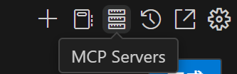
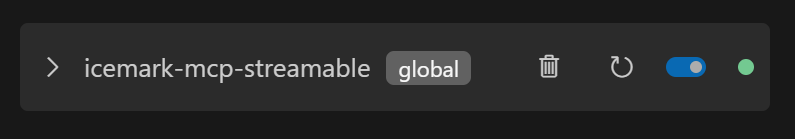
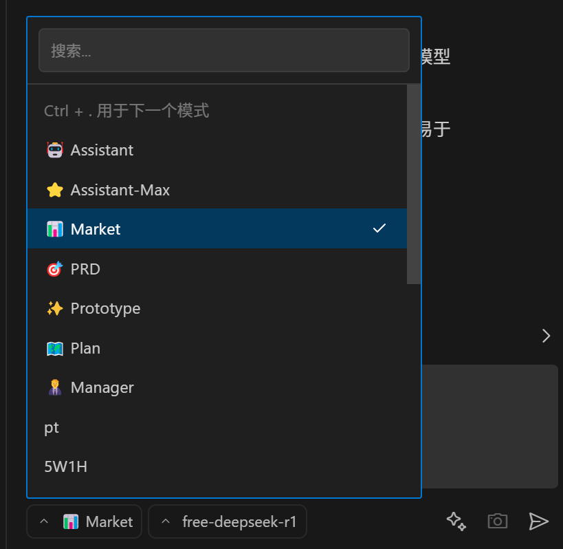

<div align="center">
<sub>

English • [简体中文](locales/zh-CN/README.md)

</sub>
</div>
<br>
<div align="center">
  <h1>Icemark</h1>
  <p align="center">
  
  </p>
  <p>Icemark, AI Agent for Product Managers</p>
</div>
<br>
<br>

**Icemark** is an AI Agent specifically designed for Product Managers, providing both specialized capabilities like market research, PRD writing, and prototype design, as well as general advanced assistance capabilities to help product managers handle various daily work challenges.

Icemark consists of two main components:

1. **Icemark Agent** - A VSCode extension plugin that executes tasks.
2. **Icemark MCP** - A toolkit that provides Icemark Agent with tools for web searching, content extraction, searches on platforms like Zhihu, Xiaohongshu, and Weibo, as well as language style management and corpus management.

## ✨ Assistant-Max Mode

A special highlight is the **Assistant-Max Mode** - an advanced cognitive iterative working mode focused on managing and executing long-term, complex tasks such as:

- Novel writing
- Market research and company analysis
- In-depth analysis on specific topics

Essentially, it can handle any information processing task.

Before starting a task, it creates a detailed plan and confirms it with you, allowing for corrections. It also has task interruption and resumption capabilities - you can stop at any time and resume when you have new materials or ideas.

This mirrors our daily work routine: establishing initial goals and plans, deepening understanding during execution, gradually modifying and adjusting plans, iterating and upgrading, and finally completing tasks.

**Note**: This mode consumes significant tokens. For testing, it's recommended to use low-cost models (we recommend OpenRouter's free DeepSeek R1). However, better models yield better results.

## 🔧 Key Features

- **Market Research**: Comprehensive market analysis and competitor research
- **PRD Writing**: Professional Product Requirements Document creation
- **Prototype Design**: Rapid prototyping and design iteration
- **Advanced Assistance**: General AI capabilities for various tasks
- **Natural Language Interaction**: Communicate using everyday language
- **File Operations**: Direct read/write operations in your workspace
- **Terminal Commands**: Execute system commands when needed
- **Customizable Modes**: Specialized personas tailored for different tasks
- **MCP Integration**: Supports not only Icemark MCP, but also community MCPs

## 🛠 Technical Foundation

Icemark is built on **Roo Code 3.5.5** with the following key adaptations:

1. **Mode Adaptation**: Added PRD, Prototype, and other modes specifically needed by Product Managers
2. **MCP Toolkit**: Provided comprehensive MCP integration to significantly enhance real-world work processing capabilities
3. **streamableHttp Protocol Support**: Enhanced collaboration stability and efficiency between Agent and MCP

## 📖 Usage Guide

### 1. Download & Installation

Icemark consists of two components: Agent (VSCode extension) and MCP (toolkit).

#### 1.1 Agent Installation

The Agent is a VSCode extension with two installation methods:

First, open VSCode extension marketplace (press `Ctrl+Shift+X` after opening VSCode).

**Method 1: Direct Search**
- Search for "Icemark" to find the extension
- Click on it and then click Install on the details page

**Method 2: Install via VSIX**
- First download the VSIX file from: https://github.com/kakuka/icemark/releases/download/v1.0/icemark-agent.vsix
- Then click "Install from VSIX" in the extension marketplace management panel


#### 1.2 MCP Installation

Choose the appropriate version based on your operating system:
- **Mac**: Download Mac version at: https://github.com/kakuka/icemark/releases/download/v1.0/Icemark.MCP-1.0.3-universal.dmg
- **Windows**: Download Windows version at: https://github.com/kakuka/icemark/releases/download/v1.0/Icemark.MCP.Setup.1.0.3.exe

**⚠️ Security Warnings Handling**

Since Icemark is not code-signed, the operating system will display security warnings:

- **Mac**: Refer to [Apple's official guide](https://support.apple.com/en-hk/guide/mac-help/mh40616/mac)
- **Windows**: Windows 11 will block via SmartScreen, simply click "Run anyway"

### 2. Configuration

#### 2.1 Configure AI Model API Keys

Configure your AI model provider's API key in Icemark Agent:
- The software provides configuration guidance
- Follow the guided steps to configure

#### 2.2 Configure Agent-MCP Connection

**Step 1: Ensure Icemark MCP is Running**

After starting Icemark MCP, find the configuration information in the help page, similar to:

```json
"icemark-mcp-streamable": {
  "autoApprove": [],
  "disabled": false,
  "timeout": 600,
  "url": "http://localhost:54321/mcp",
  "transportType": "streamableHttp",
  "alwaysAllow": []
}
```

> 📝 **Note**: By default, Icemark MCP runs on port 54321. If this port is occupied, it will automatically select another port.

**Step 2: Add MCP Configuration in Agent**

1. Copy the above configuration information
2. Open Icemark Agent's MCP management panel (top toolbar)
3. Click "MCP servers" button
4. Click "Edit Global Configuration"
5. Paste the configuration information and save



Final configuration result:

```json
{
  "mcpServers": {
    "icemark-mcp-streamable": {
      "autoApprove": [],
      "disabled": false,
      "timeout": 600,
      "url": "http://localhost:54321/mcp",
      "transportType": "streamableHttp",
      "alwaysAllow": []
    }
  }
}
```

**Step 3: Confirm Connection Status**

Verify the connection status and click the reconnect button if necessary.



#### 2.3 Icemark MCP Configuration (Optional)

Configure the following in Icemark MCP's configuration page:

**Website Login**
- Used to obtain information from websites that require login
- Enter the target website address as prompted and log in
- Icemark MCP's built-in browser will save login information
- Logins expire and may need periodic re-login
- Applicable for Zhihu search, Xiaohongshu search, Weibo search, etc.

**Language Style Configuration**
- Provide corpus for specific language styles
- When using Icemark Agent, tell it to use MCP tools
- Can generate content in specific styles (e.g., Jin Yong style, Han Han style, etc.)

### 3. Getting Started

After configuration, you can start using:

1. **Select Appropriate Mode**: Click the bottom-left corner of the dialog to switch
2. **Start with Basic Mode**: Recommended to begin with the basic Assistant mode
3. **Use Custom Modes**: After becoming familiar, use advanced custom mode features



> 💡 **Advanced Tip**: For detailed custom mode instructions, refer to [Roo-code Documentation](https://docs.roocode.com/features/custom-modes)

---

## Disclaimer

**Please note** that Icemark, Inc does **not** make any representations or warranties regarding any code, models, or other tools provided or made available in connection with Icemark, any associated third-party tools, or any resulting outputs. You assume **all risks** associated with the use of any such tools or outputs; such tools are provided on an **"AS IS"** and **"AS AVAILABLE"** basis. Such risks may include, without limitation, intellectual property infringement, cyber vulnerabilities or attacks, bias, inaccuracies, errors, defects, viruses, downtime, property loss or damage, and/or personal injury. You are solely responsible for your use of any such tools or outputs (including, without limitation, the legality, appropriateness, and results thereof).

---