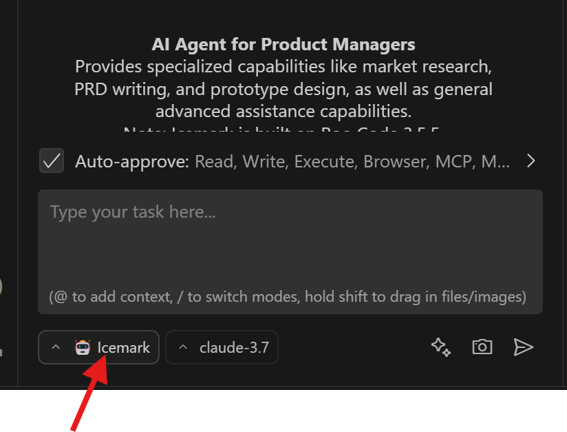

# Icemark English Documentation

**Navigation:**

- [website: icemark.tech](https://icemark.tech)
- [Documentation](https://github.com/kakuka/icemark/blob/main/docs/en/index.md)
- [中文](README.zh-CN.md)

---

 

  <h1>Icemark</h1>
  

    
  

  
<strong>Icemark, AI Agent for Product Managers</strong>

 

## 📋 Product Overview

**Icemark** is an AI Agent for Product Managers, providing not only specialized capabilities like market research, PRD writing, and prototype design, but also general assistance capabilities to help product managers handle various daily work challenges.

## ⭐ Main Features

Icemark provides four core working modes, each deeply optimized for specific work scenarios of product managers:

### 1️⃣ General Assistant **Icemark Mode**

This is a versatile AI assistant with comprehensive capabilities including planning, analysis, execution, problem-solving, and research. Through the intelligent Task Manifest document management system, it can handle complex multi-step projects, support task interruption and resumption, ensuring work continuity and controllability. Whether for daily work assistance or complex project management, it provides professional support.

### 2️⃣ Market Analysis **Market Mode**

An elite-level analysis assistant specifically designed for market research and competitive analysis. Utilizing professional analysis frameworks such as SWOT analysis, PESTEL analysis, Porter's Five Forces model, and market segmentation strategies, combined with real-time data search and deep content extraction capabilities, it generates structured multi-dimensional market analysis reports. Helps product managers deeply understand market environments and seize business opportunities.

### 3️⃣ PRD Writing **PRD Mode**

A professional requirements analysis assistant based on user stories, JTBD (Jobs-to-be-Done) theory, and the three-question method. Through systematic requirement mining methods, it deeply understands users' real needs, analyzes the four driving forces of user behavior (push, pull, anxiety, habits), and creates clear and complete product requirement documents, ensuring product design truly meets user needs.

### 4️⃣ Rapid Prototype Generation **Prototype Mode**

A professional product prototype creation assistant that can quickly generate HTML-format interactive prototypes based on product requirements. Supports multi-platform prototype design for Web, mobile, and desktop, providing modern UI interfaces and user-friendly interactive experiences, helping product managers quickly validate product concepts and showcase design ideas.

---

**✨ Core Advantages**: Icemark provides numerous basic tools, such as:

- Internet search, including Bing, Baidu, Sogou, and DuckDuckGo
- Web information extraction and conversion to Markdown
- Social platform search, such as Zhihu, Xiaohongshu, Weibo, etc.

With Icemark, you no longer need other similar paid MCP services, providing one-stop solutions for common problems.

## 💻 Main Interface

  

## 📥 Download & Installation

Icemark is a Visual Studio Code extension, with the simplest installation method being direct installation through the extension interface.

> ⚠️ **Important Note**: To use Icemark, you must first install Visual Studio Code (VSCode). Installation instructions: https://code.visualstudio.com/

After installing VSCode, there are three ways to install Icemark:

### 🔍 Method 1: Direct Search
- Launch VSCode and open the extension marketplace (`Ctrl+Shift+X`)
- Search for "**Icemark**" to find it
- Click on the extension, then click **Install** on the details page

### 🌐 Method 2: Marketplace Installation
- Open VSCode's online marketplace page: https://marketplace.visualstudio.com/items?itemName=icemark-tech.icemark-agent
- Click the **Install** button, which will automatically launch VSCode and follow the prompts for installation

> 💡 If you cannot access VSCode's online marketplace due to network issues, you can use the VSIX file for direct installation below.

### 📦 Method 3: Install via VSIX
- First download the VSIX file: https://github.com/kakuka/icemark/releases/latest/download/icemark-agent.vsix  (If this link does not work, here is an alternative : https://gitee.com/kakuka1988/icemark/releases/download/v1.0.0/icemark-agent.vsix )
- Launch VSCode and open the extension marketplace (`Ctrl+Shift+X`)
- Click "**Install from VSIX**" in the extension marketplace management panel

  

After installation is complete, click the Icemark icon in the left sidebar.
> Icon location: The `entry` position shown in the main interface image above.

## ⚙️ Initial Configuration

Icemark supports multiple LLM providers, which can be configured according to your preferences.

### 🔑 Configure API Keys

When Icemark starts, you will see relevant prompts. Simply follow the instructions to configure.

For Chinese users, we recommend using DeepSeek: https://www.deepseek.com/
- After registering an account, obtain the API key at: https://platform.deepseek.com/
- Fill this key into Icemark's model configuration.
- Select Model and save.

  

For providers like Alibaba Cloud, ByteDance's Volcano Engine, etc., you can choose `OpenAI Compatible`:

**Required configuration parameters:**

| Parameter | Description | How to Obtain |
|-----------|-------------|---------------|
| Base URL | API base URL | Obtain from large model service provider |
| API Key | Access key | Obtain from large model service provider |
| Model | Model name to use | Obtain from large model service provider |

  

You can add other providers or adjust existing configurations later.
>Location: The `LLM Config` configuration shown in the main interface image above.

### 🎯 Getting Started

After completing the initial configuration, you can use Icemark's various capabilities. We recommend starting with **Icemark mode**.

  

---

Now, you should be able to handle many tasks through Icemark. If you're already familiar with Icemark, we recommend trying the advanced features.

## 🚀 Advanced Usage

Icemark provides custom modes to help you further improve work efficiency:

### 🛠️ Custom Modes

Custom modes allow you to extend Icemark's capabilities or customize working mechanisms that better match your work. It's definitely worth trying.

**📖 Reference Documentation:**
- [modes](https://github.com/kakuka/icemark/blob/main/docs/en/modes.md)

---

## 🛠️ Technical Foundation

Icemark is built on **RooCode 3.5.5**.

---

## ⚖️ Disclaimer

**Please note** that Icemark, Inc **does not** make any representations or warranties regarding any code, models, or other tools provided or made available in connection with Icemark, any associated third-party tools, or any resulting outputs. You assume **all risks** associated with the use of any such tools or outputs; such tools are provided on an **"AS IS"** and **"AS AVAILABLE"** basis. Such risks may include, without limitation, intellectual property infringement, cyber vulnerabilities or attacks, bias, inaccuracies, errors, defects, viruses, downtime, property loss or damage, and/or personal injury. You are solely responsible for your use of any such tools or outputs (including, without limitation, the legality, appropriateness, and results thereof).