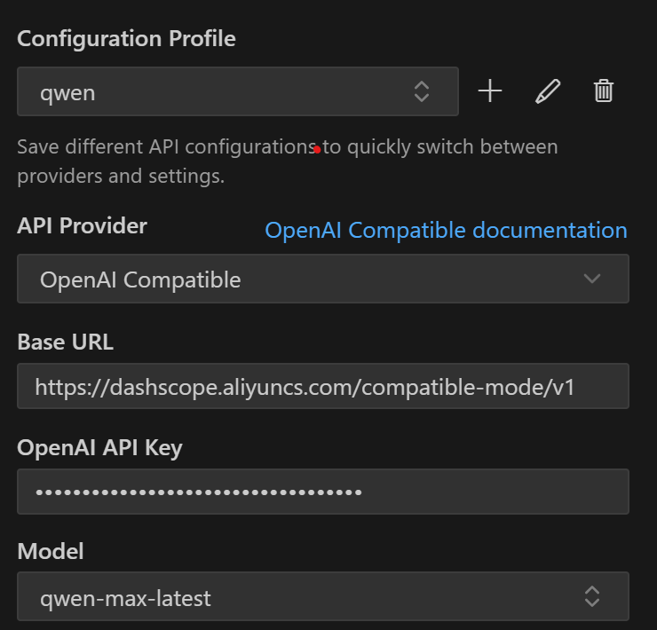

# Icemark 中文文档

**跳转导航:**

- 官网: [icemark.tech](https://icemark.tech)
- GitHub: [https://github.com/kakuka/icemark](https://github.com/kakuka/icemark)
- [English](https://github.com/kakuka/icemark/blob/main/README.md)

---

 

  <h1>Icemark</h1>
  

    
  

  
<strong>Icemark, 产品经理的AI Agent</strong>

 

## 📋 产品概述

**Icemark** 是一个产品经理的AI Agent，不仅具备市场调研、PRD编写、原型设计等专用能力，也具备通用辅助能力，能够帮助产品经理应对日常各种工作挑战。

## ⭐ 主要功能

Icemark提供四个核心工作模式，每个模式都针对产品经理的特定工作场景进行了深度优化：

### 1️⃣ 通用助手 **Icemark 模式**

这是一个全能型AI助手，具备规划、分析、执行、问题解决、研究等综合能力。通过智能的Task Manifest任务文档管理系统，能够处理复杂的多步骤项目，支持任务中断与恢复，确保工作的连续性和可控性。无论是日常工作协助还是复杂项目管理，都能提供专业支持。

### 2️⃣ 市场分析 **Market 模式**

专为市场调研和竞争分析设计的精英级分析助手。运用SWOT分析、PESTEL分析、波特五力模型、市场细分策略等专业分析框架，结合实时数据搜索和深度内容提取能力，生成结构化的多维度市场分析报告。帮助产品经理深入理解市场环境，把握商业机会。

### 3️⃣ PRD编写 **PRD 模式**

基于用户故事、JTBD（Jobs-to-be-Done）理论和三问法的专业需求分析助手。通过系统性的需求挖掘方法，深入理解用户真实需求，分析用户行为的四种驱动力（推力、拉力、焦虑、习惯），创建清晰完整的产品需求文档，确保产品设计真正满足用户需要。

### 4️⃣ 快速生成原型 **Prototype 模式**

专业的产品原型创建助手，能够根据产品需求快速生成HTML格式的交互原型。支持Web、移动端、桌面端等多平台原型设计，提供现代化的UI界面和用户友好的交互体验，帮助产品经理快速验证产品概念和展示设计想法。

---

**✨ 核心优势**：Icemark提供了大量基础工具，比如：

- 互联网搜索，包括bing、百度、sogou和duckduckgo
- 网页信息提取，并转换为markdown
- 社区网址搜索，比如知乎、小红书、微博等

使用Icemark，你不需再使用其他类似的付费MCP服务，一站式解决常规问题。

## 💻 主界面

  

## 📥 下载与安装

Icemark是一个Visual Studio Code的扩展，最简单的方式是直接在扩展界面进行安装。

> ⚠️ **重要提示**：要使用Icemark，必须先安装Visual Studio Code（简称VSCode），安装方法参考：https://code.visualstudio.com/

在安装VSCode之后，有以下三种安装Icemark的方式：

### 🔍 方式一：直接搜索

- 启动VSCode，打开扩展市场（`Ctrl+Shift+X`）
- 搜索"**Icemark**"即可找到
- 点击扩展，然后在详情页面点击**安装**

### 🌐 方式二：市场安装

- 打开VSCode的在线市场页面：https://marketplace.visualstudio.com/items?itemName=icemark-tech.icemark-agent
- 点击**安装**按钮，然后会自动唤起VSCode，按照提示进行安装

> 💡 如果因为网络等问题，打不开VSCode的在线市场，可以使用下面的VSIX文件直接安装。

### 📦 方式三：通过VSIX安装

- 首先下载VSIX文件：https://github.com/kakuka/icemark/releases/latest/download/icemark-agent.vsix (备用链接：https://gitee.com/kakuka1988/icemark/releases/download/v1.0.0/icemark-agent.vsix )
- 启动VSCode，打开扩展市场（`Ctrl+Shift+X`）
- 在扩展市场的管理面板中点击"**Install from VSIX**"

  

安装完成后，点击左侧边栏的Icemark图标。

> 图标位置：前面主界面的图片中的主入口位置。

## ⚙️ 初始化配置

Icemark支持多个大模型提供商，可以根据自己喜好进行配置。

### 🔑 配置密钥

在Icemark启动时，需要进行供应商和模型配置。

对于中国用户，推荐使用DeepSeek：https://www.deepseek.com/:

- 注册账号后，获取API key，地址：https://platform.deepseek.com/
- 将该key填到Icemark的模型配置中。

  

对于阿里云、字节的火山引擎等，可以选择 `OpenAI Compatible`：

**需要配置的参数：**

| 参数     | 说明           | 获取方式           |
| -------- | -------------- | ------------------ |
| Base URL | API基础地址    | 从大模型服务商获取 |
| API Key  | 访问密钥       | 从大模型服务商获取 |
| Model    | 使用的模型名称 | 从大模型服务商获取 |

  

后续可以新增其他供应商或对已有配置进行调整。

> 位置：前面主界面的图片中的模型配置。

### 🎯 开始使用

完成初始化配置后，你即可使用Icemark的各种能力，推荐从**Icemark模式**开始。

  

---

现在，你应该已经可以通过Icemark处理很多工作了，如果对Icemark已经比较熟悉，推荐你进一步尝试高级用法。

## 🚀 高级用法

Icemark还提供了自定义模式，助您进一步提升工作效率：

### 🛠️ 自定义模式

自定义模式可以让你扩展Icemark的能力，或者定制和你的工作更加匹配的工作机制，非常值得尝试。

**📖 参考文档：**

- [模式](https://github.com/kakuka/icemark/blob/main/docs/zh-CN/modes.md)

---

## 🛠️ 技术基础

Icemark基于 **Roo Code 3.5.5** 开发。

## 📬 联系我们

有任何疑问或建议，欢迎联系 <icemark.tech@gmail.com>

---

## ⚖️ 免责声明

**请注意**，Icemark, Inc. **不**对任何与 Icemark、任何相关的第三方工具或任何由此产生的输出相关的代码、模型或其他工具作任何陈述或保证。您承担与使用任何此类工具或输出相关的所有风险；此类工具均按"**现状**"和"**现有**"基础提供。此类风险可能包括但不限于知识产权侵权、网络漏洞或攻击、偏见、不准确、错误、缺陷、病毒、停机、财产损失或损坏和/或人身伤害。您对任何此类工具或输出的使用（包括但不限于其合法性、适当性和结果）负全部责任。
