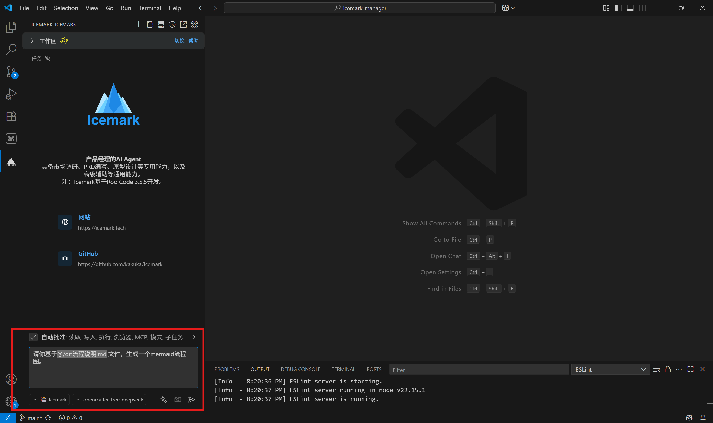
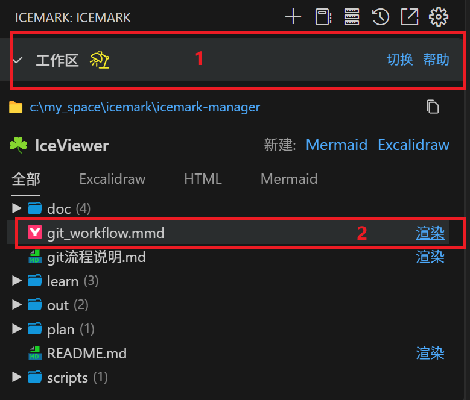
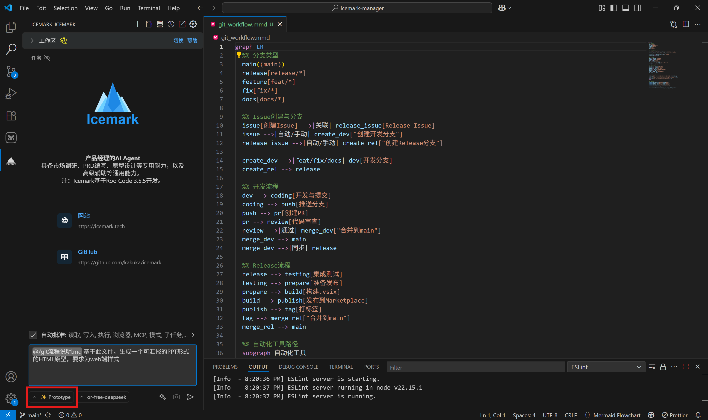
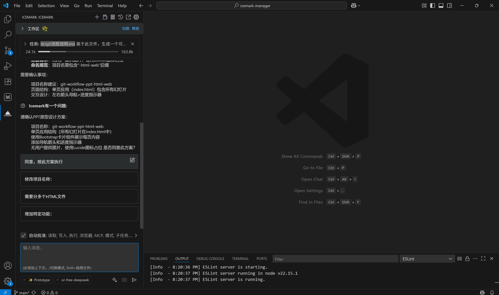
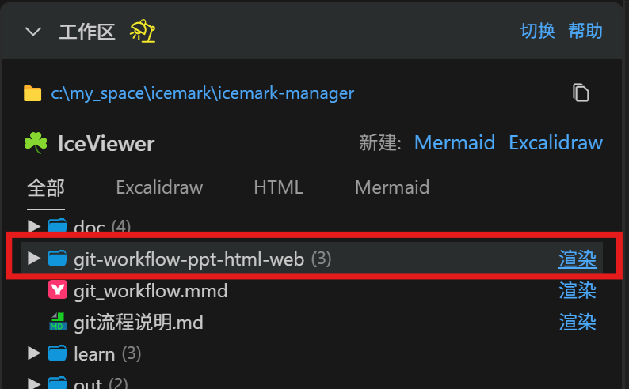

## How to Use Icemark to Generate Flowcharts and PPT?

### Generating Flowcharts

Generating flowcharts is very simple.

First, select the Icemark mode, then describe the process to Icemark and let it generate a Mermaid file.

You have multiple ways to describe the process:
- Directly describe the process in the input, suitable for relatively simple processes;
- Save the process as a file, place it in the workspace, and then specify Icemark to use that file through the @ symbol;
- You can also input a URL and let Icemark read it. Note: After inputting a URL, Icemark will launch a browser to load the web content. It may be slow the first time because it needs to download the browser remotely, and Windows may pop up a dialog asking whether to allow Chromium to access the network - you need to click agree.

    

Then press Enter to run.

Icemark starts executing the task, and it will judge whether it needs to generate a task plan file based on the complexity of the task.

For complex tasks, Icemark will always first generate a task plan file. You can read this file to judge whether it's reasonable. If not reasonable, you can pause the task and let Icemark adjust the plan.

After the task is completed, Icemark will generally call tools to display the result, and the following preview window will pop up.

    

If there are errors on the right side of the window, it's generally because Icemark's output has syntax errors. Copy and filter the errors, input them to Icemark and let it make corrections.

In addition to letting Icemark automatically open the result preview, you can also manually open it through the workspace:
1. Click on the workspace to expand files (1)
2. Find the file generated by this task, then click render (2)

    

This will also open the previous interface.

Additionally, the opened rendering page supports real-time rendering and auto-save functionality, so you can modify the original code of the file on the left side of the page and directly observe the content changes on the right side. All changes will be automatically saved to the file.

### Generating PPT

Icemark currently does not support directly generating PPT files, but can generate PPT-style HTML.

Let's continue with the above process as an example.

First, switch to `prototype` mode. This step is very important because prototype mode is specifically customized for generating prototypes and other HTML graphic information.

Then, specify the process content and let Icemark generate a PPT-style presentation prototype. Prototype supports generating various style prototypes for web, mobile, and desktop platforms. Here we specify web platform.

    

After the task starts, Icemark may ask several questions to clarify the task, such as platform type, planned number of pages, etc. You can choose the answers it provides, or directly input your requirements in the input box.

    

After confirming the task, Icemark will first use tools to initialize the folder for this task. This folder contains the static resources needed for the task, and the final HTML page will also be placed in this folder.

The initially generated content may have issues. You can use the browser to open developer tools, find the error content, copy it to Icemark, and let it make corrections.

Icemark will also directly display the final result by calling tools. You can click `Open in Browser` in the browser to open it in full screen:

    

Of course, just like the previous flowchart example, you can also expand files in the workspace and click render.

    

Additionally, you can find the file path of this HTML and open it directly in the browser. 