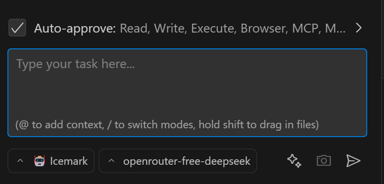

## How to Use Free Large Language Models Like DeepSeek in Icemark?

You can leverage [OpenRouter](https://openrouter.ai/).


## 1. OpenRouter Overview

OpenRouter is an AI model aggregation platform that provides the following core capabilities:

1. **Multi-model Access**: Supports 400+ mainstream AI models, including the entire DeepSeek series
2. **Unified API Interface**: OpenAI-compatible API calling method
3. **Free Model Strategy**: Models marked as (free) can be used for free (such as the DeepSeek-R1 series)
4. **Developer Friendly**: Automatically handles routing, version management, and billing optimization

Simply put, once you connect to OpenRouter, you no longer need to separately connect to OpenAI, Google, DeepSeek, and other model service providers. OpenRouter provides unified access to related models, greatly reducing the difficulty of using models and greatly enriching your choice space.

For me, I generally use free DeepSeek for general tasks and only use Claude, Gemini, and OpenAI models for complex tasks.


Currently available free DeepSeek models:
```markdown
- deepseek/deepseek-r1:free (Basic version)
- deepseek/deepseek-r1-0528:free (May 2025 upgraded version)
- deepseek/deepseek-v3-0324:free (Math/code specialized version)
```

In addition to free DeepSeek, it also has some other free models. You can search for "free" on the models page to view the list.

Query link: [https://openrouter.ai/models?q=free](https://openrouter.ai/models?q=free)


## 2. Getting OpenRouter API Key

### Step 1: Register Account
Visit [OpenRouter Official Website](https://openrouter.ai/) and quickly register using GitHub/Google/MetaMask

### Step 2: Create API Key
1. After logging in, go to [API Keys Management Page](https://openrouter.ai/keys)
2. Click "Create new key"
3. Enter key name (such as "Icemark-OpenRouter")
4. Click "Create" to generate the key
5. Copy the key. Note that you must save it in time, because for security reasons, OpenRouter does not provide subsequent viewing again.


## 3. Icemark Configuration

<div align="center">
  
</div>

Configuration in Icemark is very simple:
1. Click the configuration button (1)
2. Click the + button to add configuration, create a new configuration, need to give it a name, such as openrouter-free-deepseek (2)
3. Select OpenRouter as the provider and configure the key generated in the previous step (3)
4. Select free DeepSeek, enter "free" to query for quick filtering (4)

Note: After configuration is complete, click save and complete to exit the configuration page.

The final result is as follows:

<div align="center">
  
</div> 