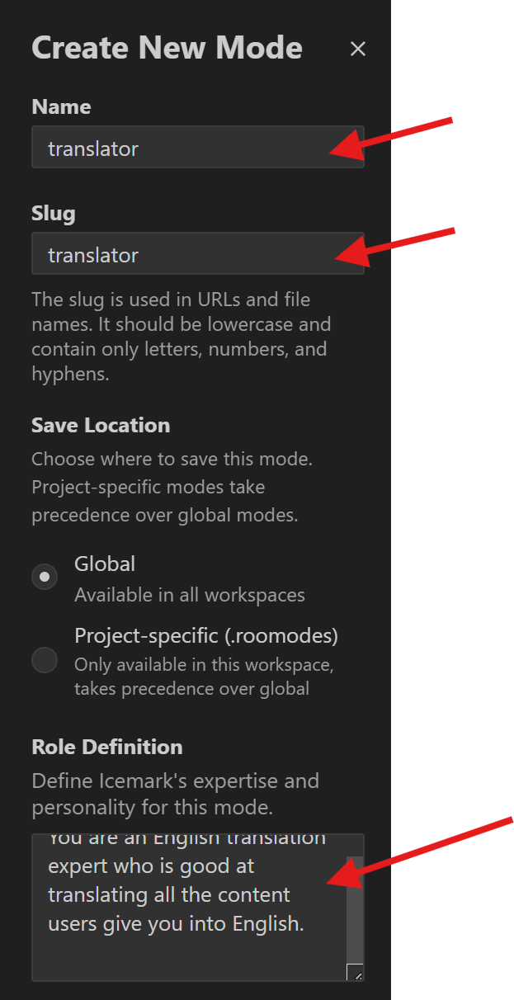
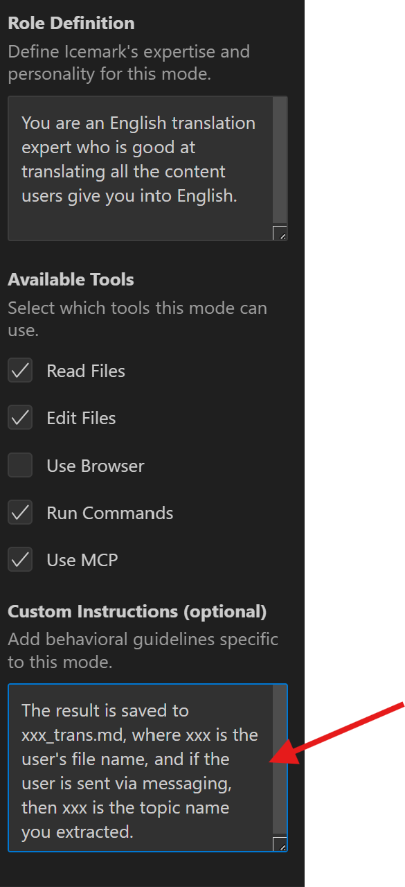

## Customizing Modes

Icemark allows you to create custom modes to adjust its behavior according to specific tasks or workflows. Custom modes can be global (applicable across all projects) or project-specific (defined only for a particular project).

> Note: Icemark is based on RooCode, and custom modes are one of RooCode's powerful features. For details, refer to: https://docs.roocode.com/features/custom-modes

### Sticky Models for Efficient Workflow

Every mode—including custom modes—supports the "sticky model" feature. This means Icemark automatically remembers and selects the model you last used in a particular mode. This allows you to assign different preferred models for different tasks without frequent reconfiguration. When you switch modes, Icemark will automatically switch the model being used.

For example, you can configure a dedicated mode for basic tasks like document organization or translation, and assign a lower-cost model to it. This improves task focus and quality while reducing costs.

### Why Use Custom Modes?

- **Specialization**: Create optimized modes for specific tasks, such as "Document Writer", "Test Engineer", or "Refactoring Expert".
  
- **Security**: Restrict access to sensitive files or commands in certain modes. For example, a "Review Mode" can be limited to read-only operations.
  
- **Experimental**: Safely try different prompts and configurations without affecting other modes.
  
- **Team Collaboration**: Share custom modes with your team to standardize workflows.

## How to Customize?

### 1. Click the mode to expand all available modes

### 2. Click the "Edit" button at the bottom

### 3. Click the "+" button in the pop-up dialog

### 4. Fill in the mode information in the custom mode dialog

and 

#### Explanation of Key Attributes for Custom Modes

Custom modes are defined by several key attributes. Understanding these concepts will help you adjust Icemark's behavior more effectively.

**Slug**

A unique identifier for internal reference. Icemark uses this to recognize the mode, especially when associating mode-specific instruction files.

**Name**

The name displayed in the Icemark user interface. It should be readable, descriptive, and easy for humans to understand.

**Role Definition**

Defines the core identity and professional domain of the mode. This text is placed at the beginning of the system prompt.

Primarily used to define Icemark's "personality" and behavior when the mode is enabled.

The first sentence (up to the first period) serves as a brief summary of the mode's general purpose for Icemark's default understanding.

**Available Tools (groups)**

Defines the set of tools the mode can use and its file access permissions.

In the user interface, this corresponds to selecting the tool categories the mode can use (e.g., read files, edit files, browse the web, or execute commands).

**Custom Instructions (Optional)**

Specifies more detailed behavioral guidelines or rules for the mode.

These instructions are added to the latter part of the system prompt to further refine Icemark's behavior based on the roleDefinition.

Can be written directly in the configuration file or referenced via external instruction files.