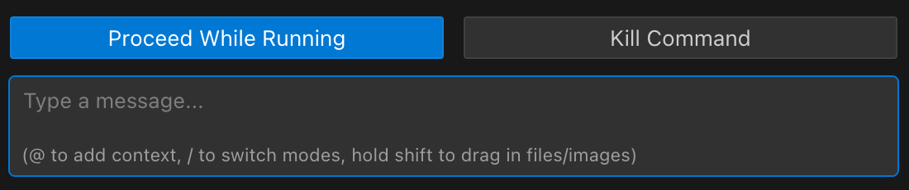

# Terminal Shell Integration

Terminal Shell Integration is a key feature that enables Icemark to execute commands in your terminal and intelligently process their output. This bidirectional communication between the AI and your development environment unlocks powerful automation capabilities.

## What is Shell Integration?

Shell integration is automatically enabled in Icemark and connects directly to your terminal's command execution lifecycle without requiring any setup from you. This built-in feature allows Icemark to:

- Execute commands on your behalf through the execute_command tool
- Read command output in real-time without manual copy-pasting
- Automatically detect and fix errors in running applications
- Observe command exit codes to determine success or failure
- Track working directory changes as you navigate your project
- React intelligently to terminal output without user intervention
- Stop running commands directly from the chat interface using the stop button that appears next to the command execution message

## Stop Command Button in Chat UI

When you ask Icemark to perform tasks like installing dependencies, starting a development server, or analyzing build errors, shell integration works behind the scenes to make these interactions smooth and effective.

## Shell Integration Troubleshooting

Shell integration is built into Icemark and works automatically in most cases. If you see "Shell Integration Unavailable" messages or experience issues with command execution, try these solutions:

- Update VSCode/Cursor to the latest version (VSCode 1.93+ required)
- Ensure a compatible shell is selected: Command Palette (Ctrl+Shift+P or Cmd+Shift+P) → "Terminal: Select Default Profile" → Choose bash, zsh, PowerShell, or fish
- Windows PowerShell users: Run `Set-ExecutionPolicy RemoteSigned -Scope CurrentUser` then restart VSCode
- WSL users: Add `. "$(code --locate-shell-integration-path bash)"` to your `~/.bashrc`

## Command Execution Fallback

Icemark has a fallback mechanism for executing commands. This is most relevant if you have chosen to use VS Code's terminal integration (by UNCHECKING the "Disable terminal shell integration" setting) and that integration then fails.

**How it works:** If Icemark is configured to use VS Code's terminal integration but cannot connect or encounters issues, it may automatically attempt to execute the command directly using a background process. This is a fallback to ensure the command still attempts to run.

**Notification:** You might see a notification in the chat if this fallback is used, indicating that the command is running without the full features of either Icemark's inline terminal or VS Code's shell integration (e.g., real-time output streaming or precise exit code detection might be limited).

**Resolution:** If you encounter this fallback, it typically indicates an issue with your VS Code shell integration setup. Please review the troubleshooting steps in this document.

> Note: Icemark is developed based on RooCode, but is more focused on product managers. Shell integration is a common development issue, RooCode has more detailed introduction: https://docs.roocode.com/features/shell-integration