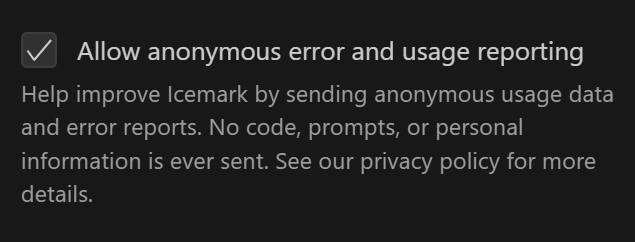

Data Collection - Telemetry

To improve the user experience, Icemark collects anonymous usage data to help understand user behavior. This mechanism is crucial for enhancing Icemark's functionality and user experience.

Icemark uses PostHog for data collection and analysis.

## Tracking Policy

Privacy is our top priority.

All data is anonymized before being sent to PostHog and does not contain any personally identifiable information (PII). Your documents, materials, prompts, and conversation content are always private and never collected.

## What We Track

We only collect basic anonymous usage data, including:

- Task interactions: When tasks start and end, conversation flow (excluding conversation content)

- Mode and tool usage: Switching between planning/execution modes, which tools are used

- Token usage: Basic metrics about conversation length for cost estimation (actual token content is not included)

- System context: Operating system type and VS Code environment information

- Interface activity: Navigation paths and feature usage

## How to Opt Out

1. During installation, a dialog regarding the use of anonymous data will pop up. Click the `Reject` button to prevent Icemark from collecting data.

2. You can turn it off at any time in the settings page.

Chinese:

English:

