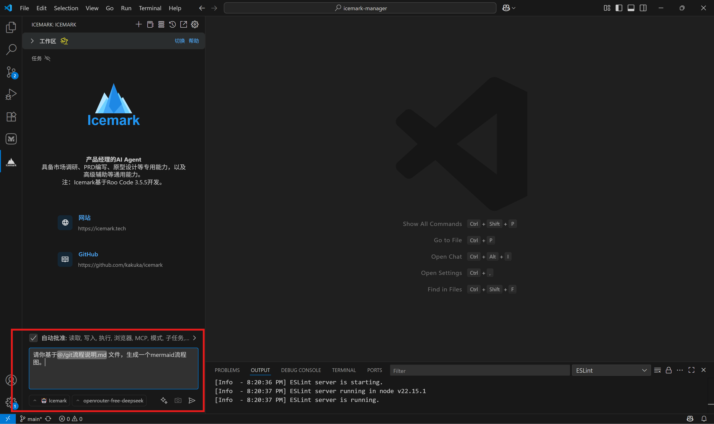
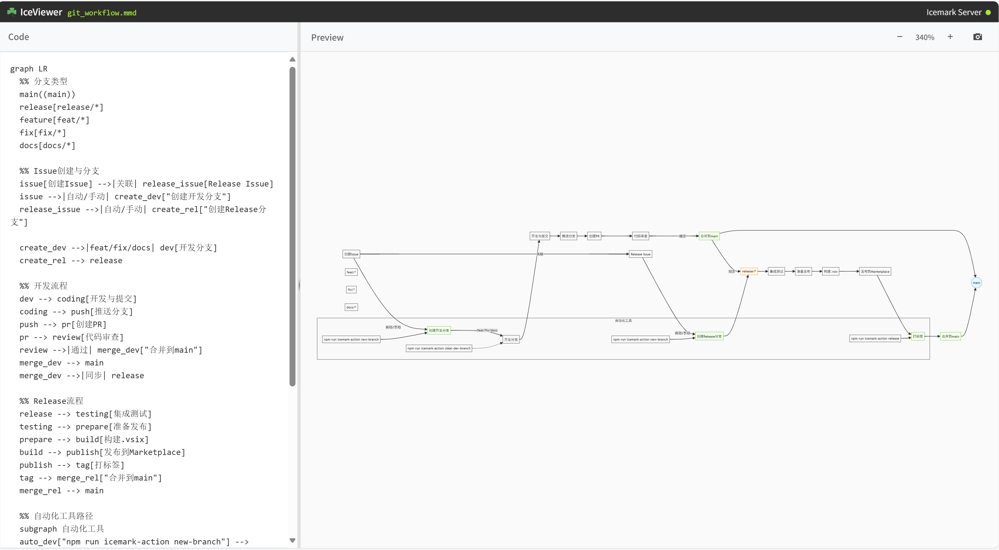
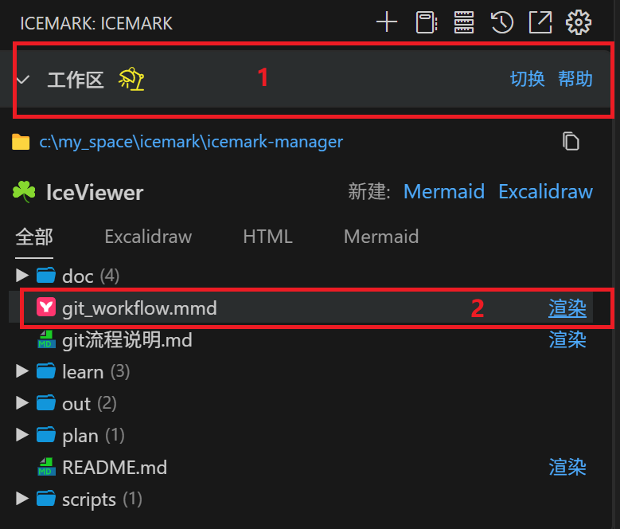
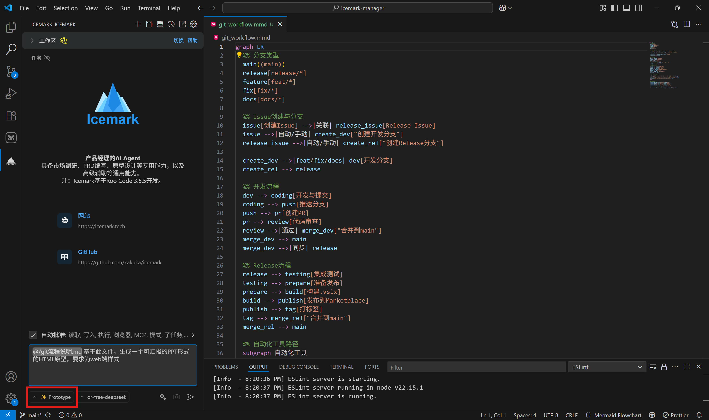
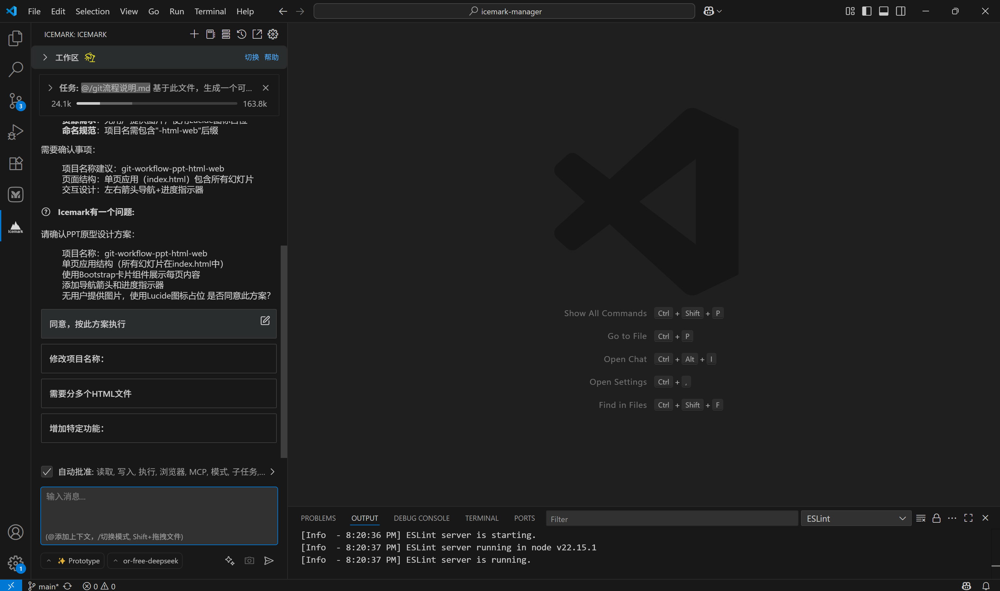
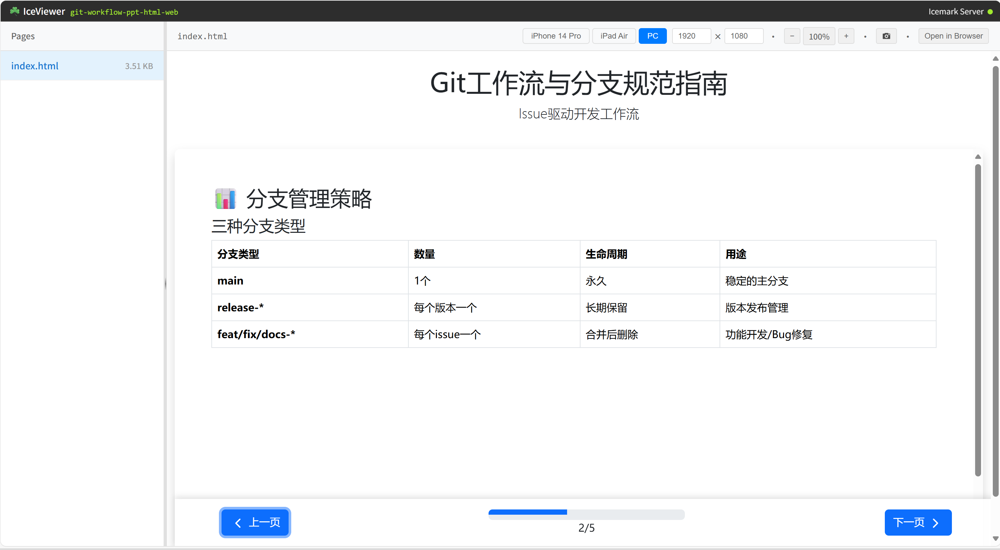
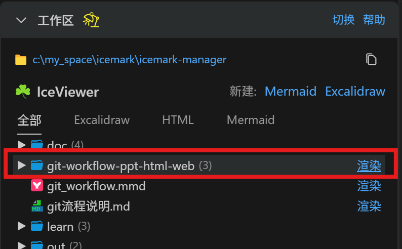

## 如何使用Icemark生成流程图和PPT？

### 生成流程图

生成流程图很简单。

首先，选择icemark模式，然后把流程描述给icemark,然后让它生成Mermaid文件即可。

你有多种描述方式：
- 直接在输入中描述流程，适合流程比较简单的情况；
- 将流程保持为一个文件，放入工作区，然后通过@符号，指定Icemark使用该文件；
- 你也可以输入一个网址，然后让Icemark阅读。注：输入网址后，icemark会启动浏览器来加载网页内容，首次可能比较慢，因为要远程下载浏览器，另外可能会弹出windows征求是否允许chromium联网的弹窗，要点击同意。

    

然后回车运行。

Icemark边开始执行任务，它会根据任务的复杂情况来判罚是否需要生成任务计划文件。

对于复杂任务，Icemark总是会先生成一个任务计划文件，你可以阅读该文件，判罚是否合理，如果不合理，可以暂停任务，让Icemark调整计划。

任务完成后，Icemark一般会调用工具进行展示，这时会弹出如下的预览窗口。

    

如果窗口右侧有报错，一般是因为Icemark输出的内容有语法错误，把错误拷贝过滤，输入给Icemark让它修改即可。

除了让Icemark自动打开结果预览外，你还可以通过工作区手动打开:
1. 点击工作区，展开文件（1）
2. 找到本次任务生成的文件，然后点击渲染（2）

    

这同样会打开前面的界面。

另外，打开的渲染页面支持实时渲染和自动保存功能，所以你可以在页面左边对文件的原始代码进行修改，直接观察右边的内容变化，所以更改都会被自动保存到文件中。

### 生成PPT

Icemark暂时不支持直接生成ppt文件，但可以生成PPT样式的HTML。

还是以上述流程为例。

首先，切换到`prototype`模式，这步很重要，因为prototype模式专门为生成原型等HTML图文信息进行了定制。

然后，指定流程内容，让icemark生成一个PPT形式的汇报展示原型，prototype支持生成web端、移动端和桌面端等多种样式原型，这里指定为web端。

    

任务开始后，Icemark可能会询问几个问题来澄清任务，比如平台类型，规划的页面数量等，你可以选择它给出的答案，或者直接在输入框输入你的要求。

    

确认任务后，Icemark首先会通过工具来初始化本次任务的文件夹，该文件夹内包含了任务所需的静态资源，并且最后的HTML页面也会放入该文件夹内。

首次生成的内容可能存在问题，你可以使用浏览器打开开发者工具，找到错误内容，拷贝给Icemark，让它改正。

最终的成果Icemark也会调用工具直接展示,你可以点击浏览器中的`Open in Browser`全屏打开 ：

    

当然，和前面的流程图的例子一样，你同样可以在工作区中，展开文件，点击渲染。

    

此外，你可以可以找到该HTML的文件路径，直接在浏览器中打开。
