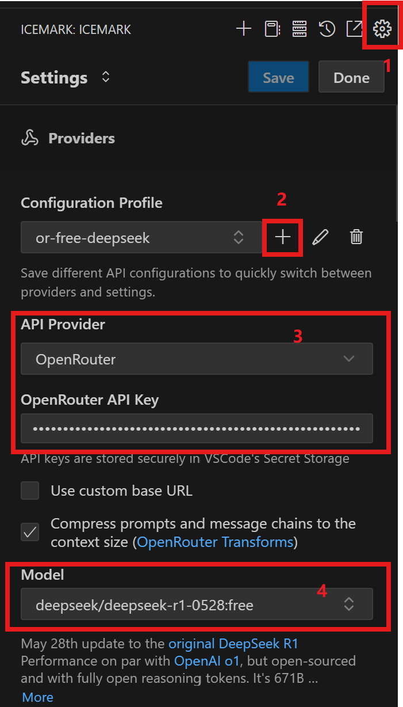
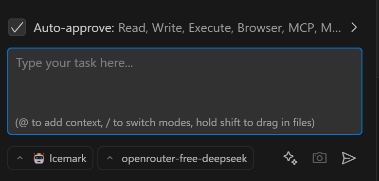

## 如何在Icemark中使用免费大模型？比如DeepSeek？

可以借助[OpenRouter] (https://openrouter.ai/).


## 一、OpenRouter简介

OpenRouter是一个的AI模型聚合平台，提供以下核心能力：

1. **多模型接入**：支持400+主流AI模型，包括DeepSeek全系列
2. **统一API接口**：OpenAI兼容的API调用方式
3. **免费模型策略**：标记(free)的模型可免费使用（如DeepSeek-R1系列）
4. **开发者友好**：自动处理路由、版本管理和计费优化

简单来说，就是你接入一个OpenRouter之后，就不用再单独接入OpenAI、Google、DeepSeek等各家模型服务商了，OpenRouter统一提供了对相关模型的使用，大大降低了模型的使用难度，并且大大丰富了你的选择空间。

对我来说，一般任务都是使用免费DeepSeek，复杂任务才使用Claude、Gemini和openai的模型。


当前可用的免费DeepSeek模型：
```markdown
- deepseek/deepseek-r1:free (基础版)
- deepseek/deepseek-r1-0528:free (2025年5月升级版)
- deepseek/deepseek-v3-0324:free (数学/代码特化版)
```

除了免费DeepSeek外，它还有一些其他免费模型，可以在模型页面搜索free，查看列表。

查询链接 ：[https://openrouter.ai/models?q=free](https://openrouter.ai/models?q=free)


## 二、获取OpenRouter API Key

### 步骤1：注册账户
访问 [OpenRouter官网](https://openrouter.ai/) 使用GitHub/Google/MetaMask快速注册

### 步骤2：创建API Key
1. 登录后进入 [API Keys管理页](https://openrouter.ai/keys)
2. 点击"Create new key"
3. 输入密钥名称（如"Icemark-OpenRouter"）
4. 点击"Create"生成密钥
5. 复制该key。注意，必须及时保存下来，因为安全原因，openrouter不提供后续的再次查看。


## 三、Icemark配置

<div align="center">
  
</div>

在Icemark中的配置非常简单：
1. 点击配置按钮（1）
2. 点击添加配置的+按钮，新建一个配置，需要起一个名字，比如openrouter-free-deepseek（2）
3. 选择OpenRouter作为提供商，并配置上一步生成的key（3）
4. 选择免费DeepSeek，输入free查询可以快速过滤 （4）

注：配置完成后，要点击保持和完成，退出配置页面。

最后结果如下：

<div align="center">
  
</div>
