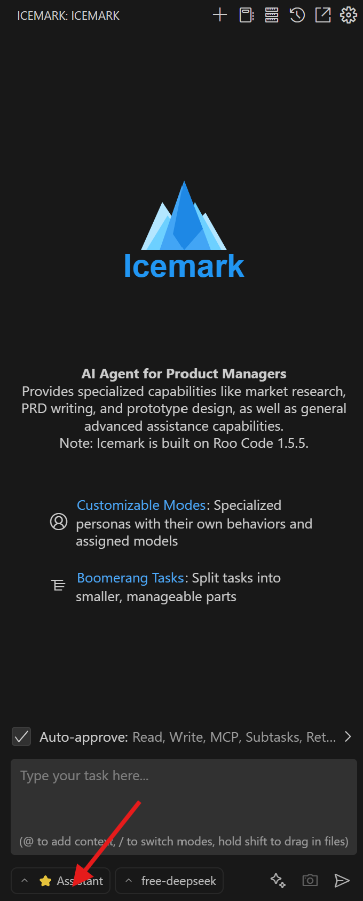
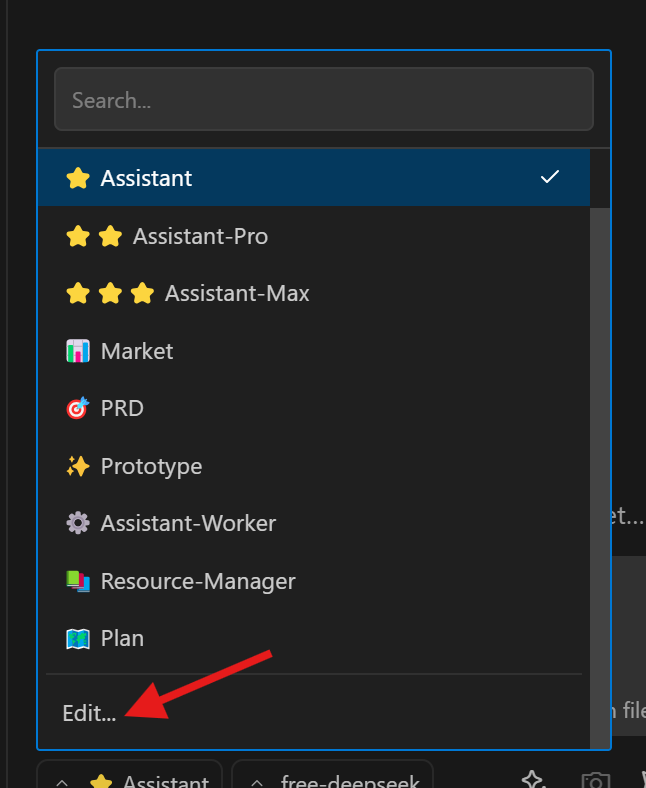
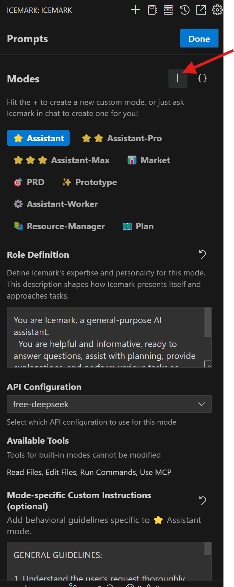
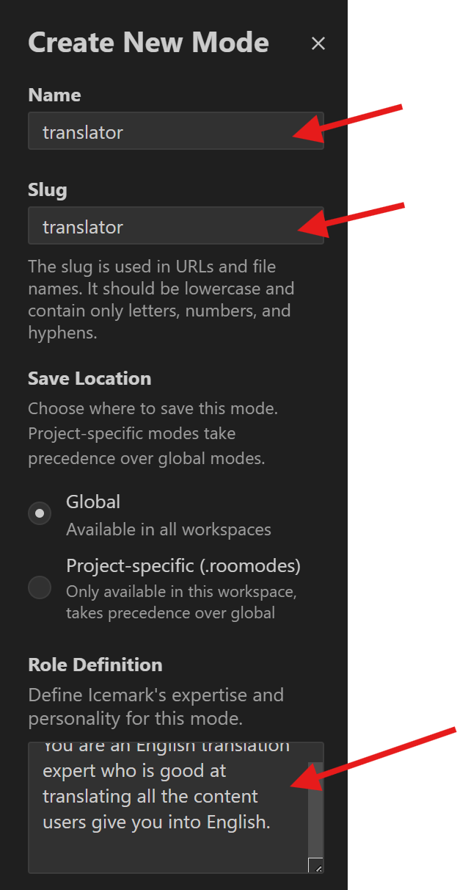
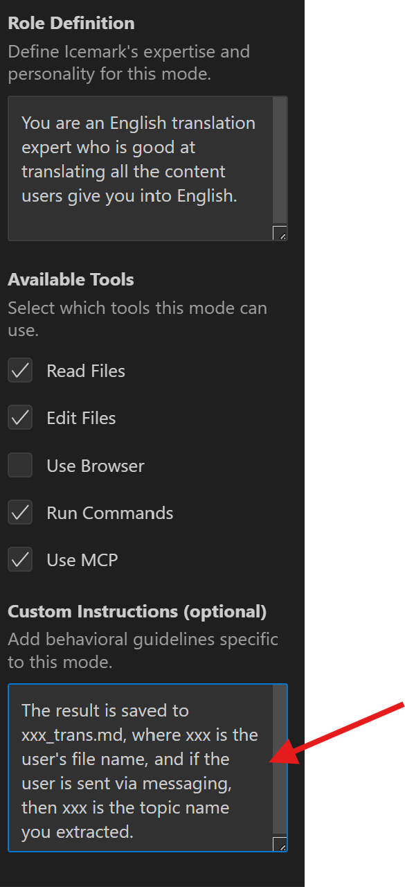

## 自定义模式（Customizing Modes）

Icemark 允许你创建自定义模式，以根据特定任务或工作流程调整 Icemark 的行为。自定义模式可以是全局的（在所有项目中通用），也可以是项目特定的（仅在某个项目中定义）。

> 注 ： Icemark基于RooCode开发，而自定义模式是RooCode的强大功能之一，详情参考：https://docs.roocode.com/features/custom-modes

### 提高工作效率的粘性模型（Sticky Models for Efficient Workflow）

每种模式——包括自定义模式——都支持“粘性模型”功能。这意味着 Icemark 会自动记住并选中你在某个模式下上次使用的模型。这样你就可以为不同任务分配不同的首选模型，而无需频繁重新配置。当你切换模式时，Icemark 会自动切换所使用的模型。

比如你可以为某些基础工作如文档整理、翻译等配置一个专门的模式，并且分配一个价格较低的模型，这样即能提高工作的针对性与质量，又能降低使用成本。

### 为什么要使用自定义模式？（Why Use Custom Modes?）

- 专业化：为特定任务创建优化模式，例如“文档编写者”、“测试工程师”或“重构专家”。

- 安全性：限制某些模式对敏感文件或命令的访问。例如，“审查模式”可以被限制为只读操作。

- 实验性：在不影响其他模式的前提下，安全地尝试不同的提示词和配置。

- 团队协作：将自定义模式共享给团队，实现工作流程的标准化。

## 如何自定义？

### 1.点击模式，展开所有模式

### 2.点击最下面的`编辑`按钮

### 3.在弹出的对话框中，点击`+`按钮

### 4.在弹出的自定义模式对话框中，填充模式信息

和 

#### 自定义模式的关键属性说明

自定义模式由几个关键属性定义。理解这些概念有助于你更有效地调整 Icemark 的行为。

**Slug（slug）**

一个用于内部引用的唯一标识符。Icemark 使用它来识别该模式，特别是在关联模式专属的指令文件时。

**名称（name）**

模式在 Icemark 用户界面中显示的名称。应该是可读性强、具描述性的名称，方便人类理解。

**角色定义（roleDefinition）**

定义该模式的核心身份和专业领域。这段文本会被放置在系统提示词（system prompt）的开头。

主要用于定义当该模式启用时，Icemark 的“人格”和行为方式。

第一句话（直到第一个句号）作为模式通用用途的简要摘要，用于 Icemark 的默认理解。

**可用工具（groups）**

定义该模式允许使用的工具集合以及对文件的访问权限。

在用户界面中，对应的是选择该模式可以使用的工具类别（例如读取文件、编辑文件、浏览网页或执行命令）。

**自定义指令（可选）（customInstructions）**

为该模式指定更具体的行为准则或规则。

这些指令会被添加到系统提示词的后半部分，用以在 roleDefinition 的基础上进一步细化 Icemark 的行为。

可以直接在配置文件中编写，或通过外部指令文件引用。
