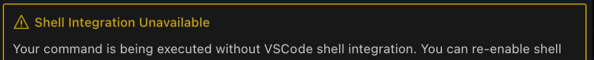

# 终端Shell集成

终端Shell集成是一个关键功能，它使Icemark能够在您的终端中执行命令并智能处理其输出。AI与您的开发环境之间的这种双向通信解锁了强大的自动化功能。

## 什么是Shell集成？

Shell集成在Icemark中自动启用，无需您进行任何设置即可直接连接到终端的命令执行生命周期。这个内置功能允许Icemark：

- 通过execute_command工具代表您执行命令
- 实时读取命令输出，无需手动复制粘贴
- 自动检测和修复正在运行的应用程序中的错误
- 观察命令退出代码以确定成功或失败
- 在您浏览项目时跟踪工作目录更改
- 在无需用户干预的情况下智能响应终端输出
- 使用命令执行消息旁边出现的停止按钮直接从聊天界面停止正在运行的命令

## 聊天UI中的停止命令按钮

当您要求Icemark执行诸如安装依赖项、启动开发服务器或分析构建错误等任务时，shell集成在后台工作，使这些交互变得流畅和有效。

## Shell集成故障排除

Shell集成内置于Icemark中，在大多数情况下自动工作。如果您看到"Shell集成不可用"消息或在命令执行时遇到问题，请尝试以下解决方案：

- 将VSCode/Cursor更新到最新版本（需要VSCode 1.93+）
- 确保选择了兼容的shell：命令面板（Ctrl+Shift+P或Cmd+Shift+P）→ "Terminal: Select Default Profile" → 选择bash、zsh、PowerShell或fish
- Windows PowerShell用户：运行 `Set-ExecutionPolicy RemoteSigned -Scope CurrentUser` 然后重启VSCode
- WSL用户：将 `. "$(code --locate-shell-integration-path bash)"` 添加到您的 `~/.bashrc`

## 命令执行回退机制

Icemark具有执行命令的回退机制。如果您选择使用VS Code的终端集成（通过取消选中"禁用终端shell集成"设置）并且该集成失败，这个机制最为相关。

**工作原理：** 如果Icemark配置为使用VS Code的终端集成但无法连接或遇到问题，它可能会自动尝试使用后台进程直接执行命令。这是一个回退机制，确保命令仍然尝试运行。

**通知：** 如果使用此回退机制，您可能会在聊天中看到通知，表明命令正在运行，但没有Icemark内联终端或VS Code shell集成的完整功能（例如，实时输出流或精确的退出代码检测可能受到限制）。

**解决方案：** 如果您遇到此回退机制，通常表明您的VS Code shell集成设置存在问题。请查看本文档中的故障排除步骤。

> 注：Icemark基于RooCode开发，但更面向产品经理。Shell 集成是一个常见的开发问题，RooCode有更详细介绍：https://docs.roocode.com/features/shell-integration