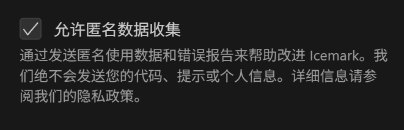
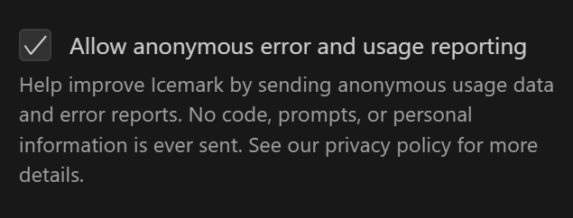

数据采集 - 遥测（Telemetry）

为优化体验，Icemark会收集一些匿名使用数据，以帮助了解用户行为。这种机制对于提升 Icemark 的功能与用户体验至关重要。

icemark使用PostHog 进行数据收集与分析。

## 追踪政策

隐私是我们的首要考量。

所有数据在发送到 PostHog 之前都会进行匿名化处理，不包含任何可识别个人身份的信息（PII）。你的文档、素材、提示词和对话内容始终是私密的，从不会被收集。

## 我们追踪哪些内容

我们仅收集一些基础的匿名使用数据，包括：

- 任务交互：任务何时开始和结束、对话流程（不包括对话内容）

- 模式与工具使用情况：在计划/执行模式之间的切换，使用了哪些工具

- Token 使用情况：关于对话长度的基本指标，用于估算成本（不会包含 token 的实际内容）

- 系统上下文：操作系统类型与 VS Code 环境信息

- 界面活动：导航路径与功能使用情况

## 如何选择退出

1.在安装时，会弹出有关使用匿名数据的对话框，点击 `拒绝` 按钮，即可禁止Icemark采集数据。

2.在设置页面，随时可以关闭。

中文：

英文：

